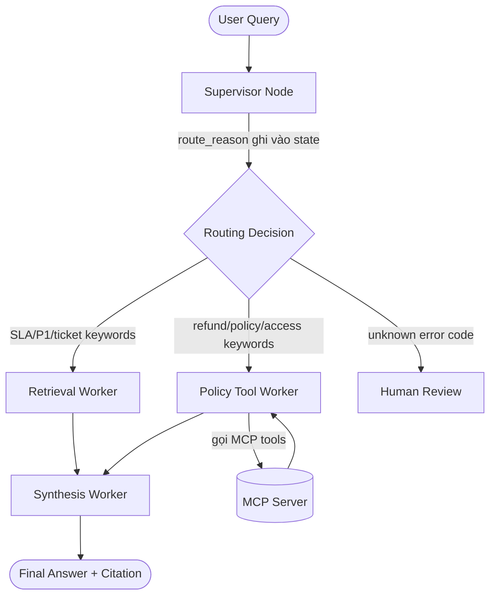

# Phân công công việc — Lab Day 09
## Multi-Agent Orchestration | 6 thành viên | 4 Sprints × 60 phút

> **Kế thừa từ Day 08:** RAG pipeline (index.py, rag_answer.py) đã có.  
> **Nhiệm vụ hôm nay:** Refactor thành hệ Supervisor + Workers có trace rõ ràng.  
> **Hard deadline code: 18:00** — sau giờ này mọi file `.py`, `.yaml`, `.jsonl`, `.md` trong `docs/` bị lock.

---

## Tổng quan vai trò

| # | Thành viên | Vai trò | File chịu trách nhiệm |
|---|---|---|---|
| 1 | **Lê Huy Hồng Nhật** | **Tech Lead + Supervisor Owner** | `graph.py`, `contracts/worker_contracts.yaml` |
| 2 | **Nguyễn Quốc Khánh** | **Worker Owner — Retrieval** | `workers/retrieval.py` |
| 3 | **Nguyễn Tuấn Khải** | **Worker Owner — Policy + Synthesis** | `workers/policy_tool.py`, `workers/synthesis.py` |
| 4 | **Phan Văn Tấn** | **MCP Owner** | `mcp_server.py`, MCP integration trong `policy_tool.py` |
| 5 | **Lê Công Thành** | **Trace & Eval Owner** | `eval_trace.py`, `artifacts/` |
| 6 | **Nguyễn Quế Sơn** | **Documentation Owner** | `docs/`, `reports/group_report.md` |

> **Quy tắc commit bắt buộc:** Mọi commit phải có initials trong message.  
> Format: `[NHat][S1] implement supervisor routing` · `[Khanh][S2] retrieval worker` · v.v.

---

## Sơ đồ phụ thuộc — Cái gì phải làm trước

```
Sprint 1 (Nhật)
└── graph.py skeleton + AgentState + contracts/worker_contracts.yaml
    │
    ├──► Sprint 2 — Khánh: workers/retrieval.py   (cần AgentState + contract)
    ├──► Sprint 2 — Khải:  workers/policy_tool.py  (cần AgentState + contract)
    │                      workers/synthesis.py     (cần policy_tool output)
    │
    ├──► Sprint 3 — Tấn:   mcp_server.py           (cần biết policy_tool cần tool gì)
    │                       integrate MCP → policy_tool.py
    │
    └──► Sprint 4 — Thành: eval_trace.py           (cần graph.py chạy được)
                    Sơn:   docs/ + reports/         (cần trace thực tế để điền)
```

**Thứ tự unblock:**
1. Nhật phải xong `AgentState` schema + `worker_contracts.yaml` **trong 20 phút đầu** → Khánh + Khải mới bắt đầu được
2. Khánh + Khải xong workers **trước Sprint 3** → Tấn mới integrate MCP vào `policy_tool.py`
3. Graph chạy end-to-end xong → Thành mới chạy được `eval_trace.py`
4. Thành có trace thực tế → Sơn mới điền được số liệu vào docs

---

## Chi tiết từng thành viên

---

### 1. Lê Huy Hồng Nhật — Tech Lead + Supervisor Owner

**Files sở hữu:** `graph.py`, `contracts/worker_contracts.yaml`  
**Sprint lead:** Sprint 1 (core), hỗ trợ unblock toàn team các Sprint sau

#### Sprint 1 (60 phút đầu) — VIỆC PHẢI XONG ĐẦU TIÊN

**Ưu tiên #1 — Làm ngay trong 20 phút đầu (unblock cả team):**

Định nghĩa `AgentState` và publish `worker_contracts.yaml` để Khánh + Khải bắt đầu được:

```python
# graph.py
from typing import TypedDict, List, Optional

class AgentState(TypedDict):
    # Input
    task: str                        # câu hỏi gốc từ user

    # Routing
    supervisor_route: str            # "retrieval_worker" | "policy_tool_worker" | "human_review"
    route_reason: str                # VD: "task contains P1 SLA keyword"
    risk_high: bool                  # True nếu cần human review

    # Worker outputs
    retrieved_chunks: List[dict]     # output của retrieval worker
    policy_result: Optional[dict]    # output của policy worker
    worker_io_log: List[dict]        # log I/O của từng worker

    # MCP
    mcp_tools_used: List[str]        # tên tools đã gọi
    mcp_results: List[dict]          # kết quả từng MCP call

    # Final
    final_answer: str
    sources: List[str]
    confidence: float
    hitl_triggered: bool
    history: List[dict]              # lịch sử các bước đã chạy
```

```yaml
# contracts/worker_contracts.yaml
retrieval_worker:
  input:
    - task: str          # câu hỏi cần tìm
  output:
    - retrieved_chunks:  # list of {text, source, section, score}
        type: List[dict]
    - worker_io_log:     # append log entry
        type: List[dict]

policy_tool_worker:
  input:
    - task: str
    - retrieved_chunks: List[dict]
  output:
    - policy_result:     # {verdict, exception_case, evidence, mcp_tool_called}
        type: dict
    - mcp_tools_used: List[str]
    - worker_io_log: List[dict]

synthesis_worker:
  input:
    - task: str
    - retrieved_chunks: List[dict]
    - policy_result: Optional[dict]
  output:
    - final_answer: str
    - sources: List[str]
    - confidence: float
    - worker_io_log: List[dict]
```

**Việc còn lại Sprint 1:**

Implement `supervisor_node()` với routing logic dựa keyword:

```python
def supervisor_node(state: AgentState) -> AgentState:
    task = state["task"].lower()

    # Routing logic — ghi rõ route_reason để trace
    if any(kw in task for kw in ["hoàn tiền", "refund", "flash sale", "digital", "license"]):
        route = "policy_tool_worker"
        reason = f"task contains refund/policy keyword"
    elif any(kw in task for kw in ["cấp quyền", "access", "level", "contractor", "emergency"]):
        route = "policy_tool_worker"
        reason = f"task contains access control keyword"
    elif any(kw in task for kw in ["p1", "escalation", "sla", "ticket", "on-call"]):
        route = "retrieval_worker"
        reason = f"task contains SLA/incident keyword"
    elif any(kw in task for kw in ["err-", "lỗi không rõ", "unknown error"]):
        route = "human_review"
        reason = f"unrecognized error code — escalate to human"
    else:
        route = "retrieval_worker"
        reason = "default route — general knowledge query"

    state["supervisor_route"] = route
    state["route_reason"] = reason
    state["risk_high"] = (route == "human_review")
    return state
```

Kết nối graph đầy đủ và test với 2 queries:
- `"SLA ticket P1 là bao lâu?"` → phải route `retrieval_worker`
- `"Khách hàng Flash Sale yêu cầu hoàn tiền"` → phải route `policy_tool_worker`

**Sprint 2-4:** Review code của cả team, unblock khi bị block, chuẩn bị runbook grading lúc 17:00.

**Commit examples:**
```
[NHat][S1] define AgentState + worker_contracts.yaml
[NHat][S1] implement supervisor routing + graph skeleton
[NHat][S1] connect full graph + smoke test 2 queries
[NHat][S4] grading runbook + final graph review
```

---

### 2. Nguyễn Quốc Khánh — Worker Owner (Retrieval)

**File sở hữu:** `workers/retrieval.py`  
**Bắt đầu:** Sau khi Nhật publish `AgentState` + `worker_contracts.yaml` (~20 phút đầu Sprint 1)

#### Sprint 1 (40 phút còn lại) — Setup + Skeleton

Tạo file, import dependencies, viết function stubs để Thành có thể test early:

```python
# workers/retrieval.py
# Author: Nguyen Quoc Khanh [Khanh]

import chromadb
import os
from datetime import datetime
from typing import Any

def run(state: dict) -> dict:
    """
    Retrieval Worker — tìm chunks liên quan từ ChromaDB
    Input: state["task"]
    Output: state["retrieved_chunks"], state["worker_io_log"]
    """
    task = state["task"]
    start_time = datetime.now()

    chunks = search_chromadb(task, top_k=5)

    # Ghi worker_io_log — BẮT BUỘC để trace hoạt động
    log_entry = {
        "worker": "retrieval_worker",
        "input": {"task": task},
        "output": {"num_chunks": len(chunks), "sources": [c["source"] for c in chunks]},
        "timestamp": start_time.isoformat(),
        "latency_ms": int((datetime.now() - start_time).total_seconds() * 1000)
    }

    state["retrieved_chunks"] = chunks
    state["worker_io_log"] = state.get("worker_io_log", []) + [log_entry]
    return state
```

#### Sprint 2 (60 phút) — Implement đầy đủ

Implement `search_chromadb()` kết nối ChromaDB thật:

```python
def search_chromadb(query: str, top_k: int = 5) -> list[dict]:
    """Tìm chunks từ ChromaDB, trả về list of {text, source, section, score}"""
    client = chromadb.PersistentClient(path=os.getenv("CHROMA_PERSIST_DIR", "./chroma_db"))
    col = client.get_or_create_collection("day09_docs")

    # Nếu collection rỗng, build index từ docs
    if col.count() == 0:
        _build_index(col)

    results = col.query(query_texts=[query], n_results=top_k)
    chunks = []
    for i, doc in enumerate(results["documents"][0]):
        chunks.append({
            "text": doc,
            "source": results["metadatas"][0][i].get("source", "unknown"),
            "section": results["metadatas"][0][i].get("section", ""),
            "score": 1 - results["distances"][0][i]  # convert distance → similarity
        })
    return chunks
```

Test độc lập (KHÔNG cần graph):
```python
# Test retrieval worker một mình
state = {"task": "SLA ticket P1 là bao lâu?", "worker_io_log": []}
result = run(state)
print(f"Chunks: {len(result['retrieved_chunks'])}")
print(f"Sources: {[c['source'] for c in result['retrieved_chunks']]}")
# Expected: sla_p1_2026.txt trong sources
```

**Sprint 3-4:** Fix bugs nếu có, viết báo cáo cá nhân.

**Phân tích cho báo cáo cá nhân:** Tập trung vào câu `gq09` (multi-hop, 16 điểm) — retrieval worker phải tìm được chunks từ **cả 2** files `sla_p1_2026.txt` + `access_control_sop.txt`. Giải thích tại sao single query có thể miss 1 trong 2.

---

### 3. Nguyễn Tuấn Khải — Worker Owner (Policy + Synthesis)

**Files sở hữu:** `workers/policy_tool.py`, `workers/synthesis.py`  
**Bắt đầu:** Sau khi Nhật publish `AgentState` + contracts (~20 phút đầu Sprint 1)  
**Dependency:** `policy_tool.py` cần MCP từ Tấn (Sprint 3) — Sprint 2 dùng stub trước

#### Sprint 1 (40 phút còn lại) — Viết cả hai skeletons

**`workers/policy_tool.py` skeleton:**

```python
# workers/policy_tool.py
# Author: Nguyen Tuan Khai [Khai]

def run(state: dict) -> dict:
    """
    Policy Tool Worker — kiểm tra policy + xử lý exception cases
    Input: state["task"], state["retrieved_chunks"]
    Output: state["policy_result"], state["mcp_tools_used"]
    """
    task = state["task"]
    chunks = state.get("retrieved_chunks", [])

    # Sprint 2: implement thật
    # Sprint 3: thay search_in_chunks() bằng MCP call
    policy_result = analyze_policy(task, chunks)

    state["policy_result"] = policy_result
    state["mcp_tools_used"] = state.get("mcp_tools_used", [])
    return state
```

**`workers/synthesis.py` skeleton:**

```python
# workers/synthesis.py
# Author: Nguyen Tuan Khai [Khai]

def run(state: dict) -> dict:
    """
    Synthesis Worker — tổng hợp final answer từ chunks + policy
    Input: task, retrieved_chunks, policy_result
    Output: final_answer, sources, confidence
    """
    # Sprint 2: implement thật
    state["final_answer"] = "[PLACEHOLDER]"
    state["sources"] = []
    state["confidence"] = 0.0
    return state
```

#### Sprint 2 (60 phút) — Implement đầy đủ

**`policy_tool.py` — xử lý exception cases (2 điểm nhóm):**

```python
EXCEPTION_RULES = {
    "flash_sale": {
        "keywords": ["flash sale", "khuyến mãi đặc biệt"],
        "verdict": "KHÔNG được hoàn tiền — đơn hàng áp dụng Flash Sale là ngoại lệ",
        "source": "policy_refund_v4.txt — Điều 3"
    },
    "digital_product": {
        "keywords": ["license key", "subscription", "kỹ thuật số", "digital"],
        "verdict": "KHÔNG được hoàn tiền — sản phẩm kỹ thuật số là ngoại lệ",
        "source": "policy_refund_v4.txt — Điều 3"
    },
    "emergency_access": {
        "keywords": ["khẩn cấp", "emergency", "p1", "tạm thời"],
        "verdict": "Có thể cấp quyền tạm thời max 24h — cần Tech Lead approve bằng lời",
        "source": "access_control_sop.txt — Section 4"
    }
}

def analyze_policy(task: str, chunks: list) -> dict:
    task_lower = task.lower()

    # Check exception cases trước
    for case_name, rule in EXCEPTION_RULES.items():
        if any(kw in task_lower for kw in rule["keywords"]):
            return {
                "exception_case": case_name,
                "verdict": rule["verdict"],
                "evidence": rule["source"],
                "mcp_tool_called": None   # Sprint 3 sẽ điền
            }

    # Không có exception — extract từ chunks
    return {
        "exception_case": None,
        "verdict": "standard_policy",
        "evidence": [c["source"] for c in chunks[:2]],
        "mcp_tool_called": None
    }
```

**`synthesis.py` — LLM generation với grounding:**

```python
SYNTHESIS_PROMPT = """Bạn là trợ lý hỗ trợ nội bộ. Chỉ trả lời từ EVIDENCE bên dưới.
Nếu không có thông tin → trả lời: "Không tìm thấy thông tin này trong tài liệu."
Luôn cite nguồn [1], [2]... sau câu trả lời.

EVIDENCE:
{evidence_block}

CÂU HỎI: {task}

Trả lời:"""

def run(state: dict) -> dict:
    from langchain_openai import ChatOpenAI
    import os

    task = state["task"]
    chunks = state.get("retrieved_chunks", [])
    policy = state.get("policy_result")

    # Build evidence block
    evidence_parts = []
    for i, c in enumerate(chunks[:3], 1):
        evidence_parts.append(f"[{i}] Nguồn: {c['source']}\n{c['text'][:400]}")
    if policy and policy.get("verdict"):
        evidence_parts.append(f"[Policy Check] {policy['verdict']} — {policy.get('evidence','')}")

    evidence_block = "\n\n".join(evidence_parts)

    if not evidence_block.strip():
        state["final_answer"] = "Không tìm thấy thông tin này trong tài liệu hiện có."
        state["sources"] = []
        state["confidence"] = 0.0
        return state

    llm = ChatOpenAI(model=os.getenv("OPENAI_CHAT_MODEL", "gpt-4o-mini"), temperature=0)
    response = llm.invoke(SYNTHESIS_PROMPT.format(evidence_block=evidence_block, task=task))

    state["final_answer"] = response.content.strip()
    state["sources"] = list({c["source"] for c in chunks[:3]})
    state["confidence"] = round(max((c.get("score", 0) for c in chunks[:1]), default=0), 2)
    return state
```

**Phân tích cho báo cáo cá nhân:** Tập trung vào `gq10` (Flash Sale + lỗi nhà sản xuất) — exception case phức tạp nhất, policy nói Flash Sale không được hoàn tiền NHƯNG điều kiện là "lỗi do người dùng". Giải thích cách policy worker quyết định.

---

### 4. Phan Văn Tấn — MCP Owner

**File sở hữu:** `mcp_server.py`, MCP integration trong `workers/policy_tool.py`  
**Bắt đầu:** Sprint 1 — setup cơ bản; Sprint 2 — implement MCP; Sprint 3 — integrate vào policy_tool

#### Sprint 1 (60 phút) — Setup + MCP skeleton

Đọc kỹ `access_control_sop.txt`, `policy_refund_v4.txt`, `sla_p1_2026.txt` để hiểu **policy_tool cần gọi tool gì**.

Tạo skeleton `mcp_server.py`:

```python
# mcp_server.py
# Author: Phan Van Tan [Tan]

from datetime import datetime
from typing import Optional
import chromadb, os

class MockMCPServer:
    """
    Mock MCP Server — cung cấp 2 tools:
    1. search_kb(query, top_k) — search Knowledge Base
    2. get_ticket_info(ticket_id) — tra cứu ticket (mock data)
    """

    def call(self, tool: str, input_data: dict) -> dict:
        timestamp = datetime.now().isoformat()

        if tool == "search_kb":
            result = self._search_kb(**input_data)
        elif tool == "get_ticket_info":
            result = self._get_ticket_info(**input_data)
        else:
            result = {"error": f"Unknown tool: {tool}"}

        # Log format bắt buộc theo README
        return {
            "tool": tool,
            "input": input_data,
            "output": result,
            "timestamp": timestamp
        }
```

#### Sprint 2 (60 phút) — Implement 2 tools đầy đủ

```python
    def _search_kb(self, query: str, top_k: int = 3) -> dict:
        """Tool 1: Search ChromaDB knowledge base"""
        try:
            client = chromadb.PersistentClient(path=os.getenv("CHROMA_PERSIST_DIR", "./chroma_db"))
            col = client.get_or_create_collection("day09_docs")
            results = col.query(query_texts=[query], n_results=top_k)

            chunks = []
            for i, doc in enumerate(results["documents"][0]):
                chunks.append({
                    "text": doc[:300],
                    "source": results["metadatas"][0][i].get("source", "unknown"),
                    "score": round(1 - results["distances"][0][i], 3)
                })
            return {"chunks": chunks, "sources": [c["source"] for c in chunks]}
        except Exception as e:
            return {"error": str(e), "chunks": []}

    def _get_ticket_info(self, ticket_id: str) -> dict:
        """Tool 2: Mock ticket lookup — trả về thông tin ticket P1"""
        mock_tickets = {
            "P1-001": {
                "id": "P1-001", "priority": "P1", "status": "open",
                "created_at": "2026-04-13T22:47:00",
                "assigned_to": None, "escalated": False
            },
            "P1-002": {
                "id": "P1-002", "priority": "P1", "status": "resolved",
                "created_at": "2026-04-13T14:00:00",
                "assigned_to": "senior-engineer-01", "escalated": True
            }
        }
        return mock_tickets.get(ticket_id, {"error": f"Ticket {ticket_id} not found"})

# Singleton để dùng chung toàn project
mcp = MockMCPServer()
```

#### Sprint 3 (60 phút) — Integrate MCP vào policy_tool.py

Phối hợp với Khải để thêm MCP call vào `policy_tool.py`:

```python
# Thêm vào workers/policy_tool.py — Tấn integrate, Khải review
from mcp_server import mcp

def run(state: dict) -> dict:
    task = state["task"]
    chunks = state.get("retrieved_chunks", [])
    mcp_calls = []

    # Gọi MCP search_kb thay vì search trực tiếp
    mcp_result = mcp.call("search_kb", {"query": task, "top_k": 3})
    mcp_calls.append(mcp_result["tool"])

    # Nếu task liên quan P1, gọi thêm get_ticket_info
    if "p1" in task.lower() and "ticket" in task.lower():
        ticket_result = mcp.call("get_ticket_info", {"ticket_id": "P1-001"})
        mcp_calls.append(ticket_result["tool"])
        state["mcp_results"] = state.get("mcp_results", []) + [mcp_result, ticket_result]
    else:
        state["mcp_results"] = state.get("mcp_results", []) + [mcp_result]

    # Phân tích policy với kết quả từ MCP
    mcp_chunks = mcp_result["output"].get("chunks", [])
    policy_result = analyze_policy(task, mcp_chunks or chunks)
    policy_result["mcp_tool_called"] = mcp_calls[0] if mcp_calls else None

    state["policy_result"] = policy_result
    state["mcp_tools_used"] = state.get("mcp_tools_used", []) + mcp_calls
    return state
```

**Phân tích cho báo cáo cá nhân:** Tập trung vào quyết định "khi nào gọi MCP vs không gọi" — Supervisor có log `route_reason` để giải thích. Giải thích tại sao dùng mock MCP thay vì direct call: decoupling, testability, future extensibility.

---

### 5. Lê Công Thành — Trace & Eval Owner

**Files sở hữu:** `eval_trace.py`, `artifacts/traces/`, `artifacts/grading_run.jsonl`  
**Bắt đầu:** Sprint 1-2 — chuẩn bị; Sprint 3 — có graph chạy được thì implement đầy đủ; Sprint 4 — chạy full eval

#### Sprint 1-2 (120 phút) — Chuẩn bị skeleton + test từng worker

Viết skeleton `eval_trace.py` và test các worker khi chúng xong:

```python
# eval_trace.py
# Author: Le Cong Thanh [Thanh]

import json
import os
from datetime import datetime
from pathlib import Path

def run_single(question: str, question_id: str = "test") -> dict:
    """Chạy 1 câu qua full graph, trả về trace record đúng format"""
    from graph import run_graph

    result = run_graph(question)

    # Format bắt buộc theo SCORING.md
    trace = {
        "id": question_id,
        "question": question,
        "answer": result.get("final_answer", ""),
        "sources": result.get("sources", []),
        "supervisor_route": result.get("supervisor_route", "MISSING"),
        "route_reason": result.get("route_reason", "MISSING"),  # thiếu = -20% điểm
        "workers_called": result.get("history", []),
        "mcp_tools_used": result.get("mcp_tools_used", []),
        "confidence": result.get("confidence", 0.0),
        "hitl_triggered": result.get("hitl_triggered", False),
        "timestamp": datetime.now().isoformat(),
    }

    # Validate: cảnh báo nếu thiếu trường quan trọng
    if trace["supervisor_route"] == "MISSING":
        print(f"⚠️  WARNING [{question_id}]: supervisor_route missing — sẽ bị trừ 20%/câu")
    if trace["route_reason"] == "MISSING":
        print(f"⚠️  WARNING [{question_id}]: route_reason missing — sẽ bị trừ 20%/câu")

    return trace
```

Chạy smoke test mỗi khi Nhật/Khánh/Khải push code mới:

```python
# Quick smoke test — chạy 3 câu để verify graph không crash
SMOKE_TESTS = [
    ("sq01", "SLA ticket P1 là bao lâu?"),
    ("sq02", "Khách hàng Flash Sale yêu cầu hoàn tiền"),
    ("sq03", "Mức phạt tài chính vi phạm SLA P1?"),   # abstain case
]
```

#### Sprint 3-4 (120 phút) — Full eval + grading formatter

```python
def run_full_eval(questions_path: str, output_dir: str = "artifacts/traces/") -> list[dict]:
    """Chạy toàn bộ test_questions.json, lưu trace"""
    Path(output_dir).mkdir(parents=True, exist_ok=True)

    with open(questions_path, encoding="utf-8") as f:
        questions = json.load(f)

    all_traces = []
    for q in questions:
        print(f"Running {q['id']}: {q['question'][:55]}...")
        try:
            trace = run_single(q["question"], q["id"])
        except Exception as e:
            trace = {
                "id": q["id"], "question": q["question"],
                "answer": f"PIPELINE_ERROR: {str(e)}",
                "supervisor_route": "ERROR", "route_reason": str(e),
                "workers_called": [], "mcp_tools_used": [],
                "sources": [], "confidence": 0.0,
                "hitl_triggered": False,
                "timestamp": datetime.now().isoformat(),
            }
            print(f"  ❌ Error: {e}")

        all_traces.append(trace)

        # Save individual trace file
        trace_path = f"{output_dir}/{q['id']}.json"
        with open(trace_path, "w", encoding="utf-8") as f:
            json.dump(trace, f, ensure_ascii=False, indent=2)

    return all_traces


def save_grading_run(traces: list[dict], output_path: str = "artifacts/grading_run.jsonl"):
    """Export ra JSONL format — 1 JSON object mỗi dòng"""
    Path("artifacts").mkdir(exist_ok=True)
    with open(output_path, "w", encoding="utf-8") as f:
        for trace in traces:
            f.write(json.dumps(trace, ensure_ascii=False) + "\n")
    print(f"✅ Grading log saved: {output_path} ({len(traces)} records)")


def analyze_trace(traces: list[dict]) -> dict:
    """Tính metrics từ traces để Sơn điền vào docs"""
    total = len(traces)
    routes = {}
    mcp_used_count = 0
    avg_confidence = 0.0
    error_count = 0

    for t in traces:
        route = t.get("supervisor_route", "unknown")
        routes[route] = routes.get(route, 0) + 1
        if t.get("mcp_tools_used"):
            mcp_used_count += 1
        avg_confidence += t.get("confidence", 0.0)
        if "PIPELINE_ERROR" in t.get("answer", ""):
            error_count += 1

    return {
        "total_questions": total,
        "routing_distribution": routes,
        "mcp_tool_usage_rate": round(mcp_used_count / total, 2) if total else 0,
        "avg_confidence": round(avg_confidence / total, 2) if total else 0,
        "error_rate": round(error_count / total, 2) if total else 0,
    }


if __name__ == "__main__":
    # Chạy full eval với test_questions
    traces = run_full_eval("data/test_questions.json")
    metrics = analyze_trace(traces)
    print(json.dumps(metrics, indent=2, ensure_ascii=False))
```

**Grading Run lúc 17:00 — Thành chịu trách nhiệm chính:**

```python
# Thêm vào cuối eval_trace.py
def run_grading(grading_path: str = "data/grading_questions.json"):
    """17:00: Chạy ngay khi có grading_questions.json"""
    traces = run_full_eval(grading_path, output_dir="artifacts/traces/grading/")
    save_grading_run(traces)
    return traces
```

**Phân tích cho báo cáo cá nhân:** Tập trung vào `gq07` (abstain case — "mức phạt tài chính vi phạm SLA P1") — không có trong tài liệu. Mô tả trace cho thấy confidence thấp → pipeline abstain đúng, so sánh với Day 08.

---

### 6. Nguyễn Quế Sơn — Documentation Owner

**Files sở hữu:** `docs/system_architecture.md`, `docs/routing_decisions.md`, `docs/single_vs_multi_comparison.md`, `reports/group_report.md`  
**Bắt đầu:** Sprint 1 — tạo templates; Sprint 2-3 — điền dần; Sprint 4 — hoàn thiện với số liệu thực từ trace

#### Sprint 1 (60 phút) — Tạo tất cả templates + bắt đầu architecture.md

**`docs/system_architecture.md`** — điền được ngay từ README + contracts của Nhật:

```markdown
# System Architecture — Day 09 Multi-Agent Orchestration

## Tại sao chọn Supervisor-Worker pattern?
[Sơn điền: so sánh với single agent Day 08 — khi RAG pipeline bắt đầu quá tải]

## Sơ đồ Pipeline (Mermaid)



## Vai trò từng thành phần

| Component | Vai trò | Ranh giới |
|---|---|---|
| Supervisor | Đọc task, quyết định route | KHÔNG xử lý content, chỉ route |
| Retrieval Worker | Tìm chunks từ ChromaDB | KHÔNG interpret, chỉ retrieve |
| Policy Worker | Kiểm tra policy, xử lý exception | Gọi MCP, KHÔNG generate answer |
| Synthesis Worker | Tổng hợp answer + citation | Dùng LLM, KHÔNG retrieve thêm |
| MCP Server | External capability layer | search_kb, get_ticket_info |
```

**Tạo templates cho các docs khác** với placeholder `[TODO: điền sau khi có trace]`

#### Sprint 2-3 (120 phút) — Điền dần từ code + trace smoke test

Cập nhật `docs/routing_decisions.md` mỗi khi Thành chạy smoke test và có kết quả:

```markdown
# Routing Decisions Log

## Quyết định 1 — P1 SLA query
**Task:** "Ticket P1 lúc 22:47 — escalation xảy ra thế nào?"
**Worker chọn:** retrieval_worker
**route_reason:** "task contains P1 SLA keyword"
**Kết quả:** ✅ Tìm được chunks từ sla_p1_2026.txt
**Bài học:** Keyword routing đơn giản đủ cho trường hợp này

## Quyết định 2 — Flash Sale refund
**Task:** "Khách hàng Flash Sale yêu cầu hoàn tiền"
**Worker chọn:** policy_tool_worker
**route_reason:** "task contains refund/policy keyword"
**Kết quả:** ✅ Policy worker detect exception case "flash_sale"
**Bài học:** ...

## Quyết định 3 — Abstain case
**Task:** "Mức phạt tài chính vi phạm SLA P1?"
**Worker chọn:** retrieval_worker → synthesis → abstain
**route_reason:** "task contains SLA keyword"
**Kết quả:** ✅ Synthesis worker trả về "không tìm thấy thông tin"
**Bài học:** Abstain xảy ra ở synthesis layer, không phải routing layer
```

#### Sprint 4 (60 phút) — Hoàn thiện với số liệu thực từ Thành

Nhận metrics từ `analyze_trace()` của Thành → điền vào `single_vs_multi_comparison.md`:

```markdown
# Single Agent (Day 08) vs Multi-Agent (Day 09) — So sánh

| Metric | Day 08 (Single) | Day 09 (Multi) | Nhận xét |
|---|---|---|---|
| Accuracy (15 test Qs) | X% | Y% | [từ trace thực] |
| Avg latency | Xms | Yms | Multi thêm routing overhead |
| Debuggability | Thấp | Cao | trace ghi rõ từng bước |
| Abstain rate | X% | Y% | |
| Hallucination rate | X% | Y% | |

## Kết luận
Multi-agent tốt hơn ở: [từ số liệu thực]
Multi-agent kém hơn ở: latency, complexity
```

Hoàn thiện `reports/group_report.md` — tổng hợp từ báo cáo của cả team.

**Phân tích cho báo cáo cá nhân:** Tập trung vào quyết định thiết kế `route_reason` — tại sao ghi string thay vì enum, trade-off giữa keyword routing vs LLM classifier routing.

---

## Timeline 4 Sprints

### Sprint 1 (Giờ 1) — Graph skeleton + contracts

| Thời điểm | Ai | Làm gì |
|---|---|---|
| 0:00 | **Nhật** | Tạo repo, push `AgentState` + `worker_contracts.yaml` — **UNBLOCK CẢ TEAM** |
| 0:20 | **Khánh + Khải** | Pull code, bắt đầu workers skeleton |
| 0:20 | **Tấn** | Đọc policy docs, setup `mcp_server.py` skeleton |
| 0:20 | **Thành** | Setup `eval_trace.py`, test ChromaDB connection |
| 0:20 | **Sơn** | Tạo tất cả doc templates, bắt đầu `system_architecture.md` |
| 0:50 | **Nhật** | Implement supervisor routing, kết nối graph |
| 0:60 | **Nhật** | Smoke test graph với 2 queries, confirm route đúng |

### Sprint 2 (Giờ 2) — Workers implement

| Thời điểm | Ai | Làm gì |
|---|---|---|
| 1:00 | **Khánh** | Implement `search_chromadb()` + test retrieval độc lập |
| 1:00 | **Khải** | Implement `analyze_policy()` + exception cases |
| 1:00 | **Khải** | Implement `synthesis.py` với LLM + grounding prompt |
| 1:00 | **Tấn** | Implement 2 MCP tools (`_search_kb`, `_get_ticket_info`) |
| 1:00 | **Thành** | Chạy smoke test từng worker khi Khánh/Khải push |
| 1:00 | **Sơn** | Điền `routing_decisions.md` từ kết quả smoke test |
| 2:00 | **Khánh + Khải** | Test workers độc lập, fix bugs |

### Sprint 3 (Giờ 3) — MCP integrate + tuning

| Thời điểm | Ai | Làm gì |
|---|---|---|
| 2:00 | **Tấn + Khải** | Integrate MCP vào `policy_tool.py` |
| 2:00 | **Nhật** | Review + merge, connect full graph end-to-end |
| 2:00 | **Thành** | Chạy full eval với 15 test questions |
| 2:30 | **Sơn** | Nhận metrics từ Thành, bắt đầu điền `single_vs_multi_comparison.md` |
| 3:00 | **Thành** | Fix trace format nếu thiếu fields |

### Sprint 4 (Giờ 4) — Finalize + Báo cáo + Grading prep

| Thời điểm | Ai | Làm gì |
|---|---|---|
| 3:00 | **Mọi người** | Viết báo cáo cá nhân |
| 3:00 | **Nhật** | Chuẩn bị grading runbook |
| 3:30 | **Sơn** | Hoàn thiện tất cả docs, `group_report.md` |
| 3:45 | **Nhật** | Final review — confirm tất cả fields trace không có "MISSING" |

### 🔴 Khung giờ Grading (17:00 – 18:00)

| Thời điểm | Ai | Làm gì |
|---|---|---|
| 17:00 | **Nhật** | Tải `grading_questions.json` → đặt vào `data/` |
| 17:01 | **Thành** | Chạy `python eval_trace.py --grading` |
| 17:15 | **Thành** | Verify `artifacts/grading_run.jsonl` — đúng format, đủ 10 records |
| 17:20 | **Nhật** | `git add . && git commit -m "[ALL][GRADING] final grading_run.jsonl"` |
| 17:30 | **Sơn** | Final check deliverables checklist |
| 17:50 | **Nhật** | **`git push` — 10 phút buffer trước deadline** |
| 18:00 | 🔒 | **HARD DEADLINE — Git lock** |

> **Sau 18:00:** Vẫn có thể commit `reports/group_report.md` và `reports/individual/[ten].md`

---

## Câu hỏi grading — Phân công phân tích cho báo cáo cá nhân

| Thành viên | Câu phân tích | Angle khai thác |
|---|---|---|
| **Nhật** | `gq09` (multi-hop, 16đ) | Tại sao cần 2 workers, routing supervisor xử lý thế nào |
| **Khánh** | `gq01` + `gq05` (SLA P1) | Retrieval từ sla_p1_2026.txt, chunking ảnh hưởng thế nào |
| **Khải** | `gq10` (Flash Sale + lỗi NSD) | Policy exception logic, conflict rule xử lý thế nào |
| **Tấn** | `gq03` (Level 3 emergency) | MCP search_kb gọi lúc nào, get_ticket_info dùng khi nào |
| **Thành** | `gq07` (abstain — phạt tài chính) | Trace confidence thấp → abstain, so sánh vs Day 08 |
| **Sơn** | Tổng quan `gq02` (temporal scope) | Route_reason design, keyword vs LLM classifier trade-off |

> ⚠️ **Mỗi người chỉ phân tích câu của mình.** Giảng viên đọc chéo — nếu 2 báo cáo phân tích cùng 1 câu với cùng góc nhìn → nghi ngờ copy.

---

## ✅ Master Checklist — Hoàn thành khi tick hết

### Code (deadline 18:00)
- [ ] `graph.py` — `python graph.py` chạy không lỗi, route đúng 2+ loại task
- [ ] `graph.py` — mọi route đều có `route_reason` không phải "unknown"
- [ ] `workers/retrieval.py` — test độc lập được, output đúng contract
- [ ] `workers/policy_tool.py` — xử lý đúng ít nhất 1 exception case
- [ ] `workers/synthesis.py` — trả về answer có citation, không hallucinate
- [ ] `mcp_server.py` — có ít nhất 2 tools (`search_kb`, `get_ticket_info`)
- [ ] `mcp_server.py` — được gọi từ `policy_tool.py`, trace ghi `mcp_tool_called`
- [ ] `contracts/worker_contracts.yaml` — đủ 3 workers, I/O rõ ràng
- [ ] `eval_trace.py` — chạy end-to-end 15 test questions không crash

### Artifacts (deadline 18:00)
- [ ] `artifacts/traces/` — có ít nhất 15 trace files từ test_questions
- [ ] `artifacts/grading_run.jsonl` — đủ 10 records, đúng JSONL format
- [ ] Mọi trace record có đủ: `id`, `answer`, `supervisor_route`, `route_reason`, `workers_called`, `sources`, `confidence`, `timestamp`

### Documentation (deadline 18:00)
- [ ] `docs/system_architecture.md` — có sơ đồ pipeline, vai trò từng worker
- [ ] `docs/routing_decisions.md` — ít nhất 3 quyết định routing thực tế từ trace
- [ ] `docs/single_vs_multi_comparison.md` — ít nhất 2 metrics có số liệu thực

### Reports (sau 18:00 được phép)
- [ ] `reports/group_report.md` — hoàn chỉnh
- [ ] `reports/individual/nhat.md` — 500-800 từ, phân tích gq09
- [ ] `reports/individual/khanh.md` — 500-800 từ, phân tích gq01/gq05
- [ ] `reports/individual/khai.md` — 500-800 từ, phân tích gq10
- [ ] `reports/individual/tan.md` — 500-800 từ, phân tích gq03
- [ ] `reports/individual/thanh.md` — 500-800 từ, phân tích gq07
- [ ] `reports/individual/son.md` — 500-800 từ, phân tích gq02

### Điểm cá nhân — Tự kiểm tra trước khi nộp
- [ ] Commit message có initials của mình trong file mình phụ trách
- [ ] Báo cáo cá nhân mô tả **đúng file mình làm** (không khai file người khác)
- [ ] Báo cáo cá nhân có ví dụ cụ thể từ **code/trace của nhóm** (không dùng ví dụ giả)
- [ ] Có thể giải thích mọi quyết định kỹ thuật trong phần mình khai báo khi bị hỏi

---

*Phân công v1.0 — Lê Huy Hồng Nhật (Tech Lead)*  
*Dựa trên README.md + SCORING.md — Lab Day 09*