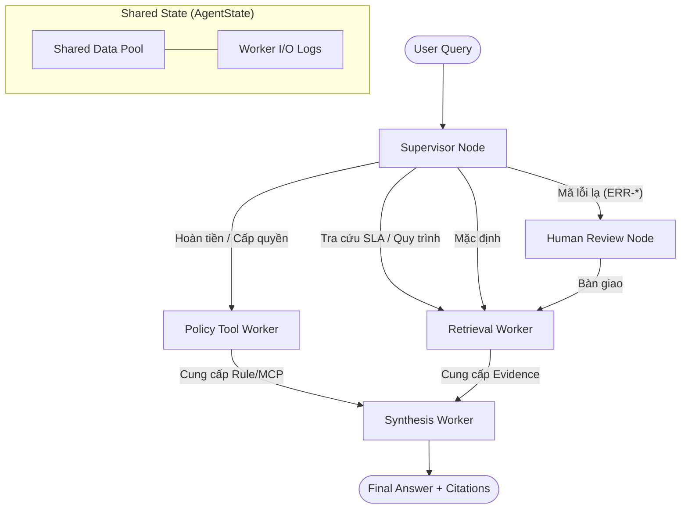

# System Architecture — Lab Day 09: Multi-Agent Orchestration

**Nhóm:** C401 - D6
**Ngày:** 14/04/2026
**Framework:** LangGraph / StateGraph

---

## 1. Mô hình kiến trúc (Orchestration Pattern)

Hệ thống trợ lý nội bộ Day 09 được tái cấu trúc từ mô hình Monolith (Day 08) sang mô hình **Supervisor-Worker** sử dụng framework **LangGraph**. Sự thay đổi này giải quyết triệt để bài toán "hộp đen" bằng cách tách biệt tầng điều hướng (Orchestration) và tầng thực thi chuyên biệt (Execution).

### Sơ đồ Pipeline thực thi
Kiến trúc hệ thống sử dụng một Supervisor duy nhất để phân luồng dựa trên intent, từ khóa và mức độ rủi ro của task.

---

## 2. Chi tiết các thành phần (Component Roles)

### 2.1 Supervisor (The Orchestrator)
Sử dụng cơ chế **Priority-based Keyword Routing**. Đây là quyết định quan trọng để đảm bảo tính dự đoán (Predictability) và tốc độ xử lý vượt trội so với việc dùng LLM để phân loại intent.
- **Quy tắc ưu tiên (Priority Hierarchy)**: `Error Escalation (HITL) > Policy Check > Retrieval`.
- **Logic**: Nếu một câu hỏi vừa chứa "SLA" vừa chứa "ERR-403", hệ thống sẽ ưu tiên escalate lên người dùng trước thay vì chỉ tra cứu SLA.

### 2.2 Policy Tool Worker (The Rule-Enforcer)
Phụ trách các logic nghiệp vụ phức tạp với 4 chiều kiểm soát ngoại lệ (Exception Scoping):
1.  **Temporal Scoping**: Nhận diện đơn hàng trước 01/02/2026 để cảnh báo về chính sách v3.
2.  **Product Exception**: Chặn hoàn tiền tự động cho hàng kỹ thuật số (License, Subscription).
3.  **State Exception**: Kiểm tra trạng thái sản phẩm (đã kích hoạt/đã mở seal).
4.  **Tool Integration**: Trực tiếp gọi MCP Tools (`check_access_permission`, `search_kb`) để lấy dữ liệu động.

### 2.3 Retrieval Worker (The Evidence Gatherer)
Kết nối trực tiếp với **ChromaDB** phục vụ tìm kiếm ngữ nghĩa (Dense Retrieval). Worker này được giữ trạng thái **Stateless**, đảm bảo có thể scale độc lập khi lượng tài liệu tăng lên.

### 2.4 Synthesis Worker (The Grounded Reasoner)
Đóng vai trò là "chốt chặn cuối cùng" chống ảo giác. 
- **System Prompt**: Chỉ thị nghiêm ngặt việc chỉ sử dụng context từ các worker trước đó. 
- **Citation**: Bắt buộc trích dẫn nguồn `[file_name]` cho mọi luận điểm quan trọng.

---

## 3. Shared State Schema (AgentState)

Hệ thống sử dụng một `TypedDict` duy nhất để truyền thông tin, giúp duy trì tính minh bạch (Transparency) của dữ liệu:

| Field | Type | Ý nghĩa kỹ thuật |
|-------|------|----------------|
| `task` | `str` | Query gốc của người dùng. |
| `route_reason` | `str` | **Lý do định tuyến** (Phục vụ debug và audit). |
| `risk_high` | `bool` | Cờ rủi ro kích hoạt HITL logic. |
| `policy_result` | `dict` | Kết quả phân tích ngoại lệ (Flash Sale, Digital, v3/v4). |
| `worker_io_logs` | `list` | Lưu vết chính xác JSON Input/Output của từng Worker (Mandatory for Grading). |
| `latency_ms` | `int` | Thời gian thực thi của luồng. |

---

## 4. Đánh giá thiết kế: Day 08 vs Day 09

| Tiêu chí | Single Agent (Day 08) | Multi-Agent (Day 09) | Tại sao? |
|----------|----------------------|--------------------------|----------|
| **Debuggability** | Khó | Rất dễ | Nhờ `route_reason` và log I/O tách biệt. |
| **Tính chuyên sâu** | Trung bình | Cao | Từng Worker có Prompt chuyên biệt cho Domain đó. |
| **Độ trễ** | Thấp (~3s) | Cao (~16s) | Đánh đổi thời gian gọi nhiều node để lấy tính chính xác. |
| **Độ phủ Policy** | Dễ sót | Rất chặt chẽ | Policy Worker chuyên trách kiểm tra các ngoại lệ rẽ nhánh. |

---

## 5. Giới hạn hiện tại và Hướng phát triển

1. **Routing**: Hiện tại dùng Keyword-matching. Nếu có thêm 1 ngày, nhóm sẽ dùng **LLM-based Intent Classifier** để xử lý các câu hỏi lắt léo hơn.
2. **MCP Connectivity**: Toàn bộ Protocol đã sẵn sàng (Standard Tools), có thể chuyển từ Mock sang Production dễ dàng.
3. **HITL**: Đã có Node Placeholder, có thể tích hợp Slack/Teams API để người dùng phê duyệt quyền trực tiếp.
